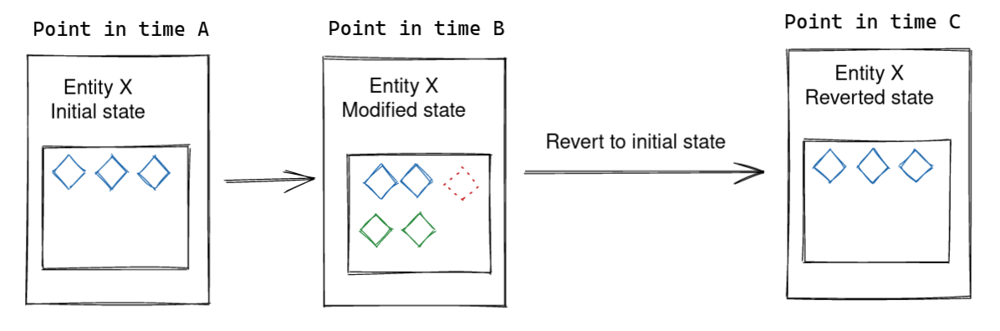

:icons: font
:allow-uri-read:
:numbered:
ifndef::env-github[:toc: left]
:toc-title: Summary
:toclevels: 5

// Define half-width and other image modifiers, see the following for details:
//   https://docs.asciidoctor.org/asciidoc/latest/macros/image-size

ifdef::backend-html5[]
:twoinches: width=144
// using a role requires adding a corresponding rule to the CSS
:full-width: role=full-width
:half-width: role=half-width
:half-size: role=half-size
:thumbnail: width=60
endif::[]
ifdef::backend-pdf[]
:twoinches: pdfwidth=2in
// NOTE use pdfwidth=100vw to make the image stretch edge to edge
:full-width: pdfwidth=100%
:half-width: pdfwidth=50%
// NOTE scale is not yet supported by the PDF converter
:half-size: pdfwidth=50%
:thumbnail: pdfwidth=20mm
endif::[]
ifdef::backend-docbook5[]
:twoinches: scaledwidth=2in
:full-width: scaledwidth=100%
:half-width: scaledwidth=50%
:half-size: scale=50
:thumbnail: scaledwidth=20mm
endif::[]

= Cohesic XTDB Docs

This document describes in more detail some of the functionality implemented in https://github.com/cohesic/cohesic-xtdb[com.cohesic/xtdb].

It assumes that you have knowledge about https://xtdb.com/docs[XTDB]'s main concepts (entity, document, transaction, etc.).

== Entity Revert

Reverting an entity is the act of taking the snapshot of an entity at a point in time in the past, removing any modifications that might have been made since.
There are three main operations we can perform on an entity:

. creation
. deletion
. modification of entity attributes

All of them can be reverted consistenly using `com.cohesic.xtdb/reverse-tx-ops-before-time`, see below diagram.

.Operations on entities and how their state reverts back to a point in time

=== Time travelling

In order to revert an entity we need go back in time and identify changes that happened before a certain time. There is no way, at the point of this writing, for XTDB to do this via direct query.

Therefore, we leverage the XTDB's https://docs.xtdb.com/language-reference/datalog-queries/#history-api[History API], filtering out the history items until we reach the one we need.
Once we find the history item and its associated document the library computes new transactions, as data, that revert the entity. It is up to the consumer of the library to submit these newly minted transactions to XTDB.

.Reverting by transacting to the entity initial state

As we mentioned above, there are three ways to modify an entity. In the following we show how the XTDB history looks like for each of them:

NOTE: history is in descending order, aka most recent at the top

* *Newly created entity:*
  ** Its history includes only a single item, the latest one.

[source, clojure]
----
[{::xt/tx-time #inst "2022-09...",
  ::xt/tx-id 2,
  ::xt/valid-time #inst "2022-09...",
  ::xt/content-hash #xtdb/id "c95f149636e0a10a78452298e2135791c0203527"
  ::xt/doc {:xt/id 3 :entity/attribute "bar"}}]
----

* *Modified entity:*
  ** The first item in its history includes the last changes made to the entity and previous items include documents at different points in time.

[source, clojure]
----
[{::xt/tx-time #inst "2022-09...",
  ::xt/tx-id 2,
  ::xt/valid-time #inst "2022-09...",
  ::xt/content-hash #xtdb/id "b95f149636e0a10a78452298e2135791c0203528"
  ::xt/doc {:xt/id 2 :entity/attribute "Mod2 foo"}}
 {::xt/tx-time #inst "2022-08...",
  ::xt/tx-id 2,
  ::xt/valid-time #inst "2022-08...",
  ::xt/content-hash #xtdb/id "a95f149636e0a10a78452298e2135791c0203529"
  ::xt/doc {:xt/id 2 :entity/attribute "Mod1 foo"}}
  {::xt/tx-time #inst "2022-07...",
  ::xt/tx-id 1,
  ::xt/valid-time #inst "2022-07...",
  ::xt/content-hash #xtdb/id "a95f149636e0a10a78452298e2135791c0203529"
  ::xt/doc {:xt/id 2 :entity/attribute "foo"}}]
----

* *Deleted entity:*
  ** Its history is similar to the above with the only difference being that the first element denotes a "delete transaction", which is still a valid, yet special, history item.
  This item is as a map with a `nil` document and a content hash filled with zeros.

[source, clojure]
----
[{::xt/tx-time #inst "2022-09...",
  ::xt/tx-id 2,
  ::xt/valid-time #inst "2022-09...",
  ::xt/content-hash #xtdb/id "0000000000000000000000000000000000000000"
  ::xt/doc nil}
 {::xt/tx-time #inst "2022-08...",
  ::xt/tx-id 1,
  ::xt/valid-time #inst "2022-08...",
  ::xt/content-hash #xtdb/id "a95f149636e0a10a78452298e2135791c0203529"
  ::xt/doc {:xt/id 2 :entity/attribute "foobar"}}]
----

Once we know how the history is represented, it is easy to see how the library can revert an entity: it is doing it by grabbing the history item right before the input time.

Nonetheless, this comes with a twist: how does the library handle an entity that was created? How does it handle a deleted entity?

It does it, roughly, this way:

* If the history item before `as-of-time` exists it means the entity was either _modified_ or _deleted_ (the resulting history item is the zeroed one). It submits a `::xt/put` transaction for updating the current state.

* If it does not exist, the entity was _newly added_. Therefore, it needs to `::xt/delete` the entity in order to revert it.

In both instances we also send a `::xt/match` against the latest document in history to guards us against concurrent changes.
